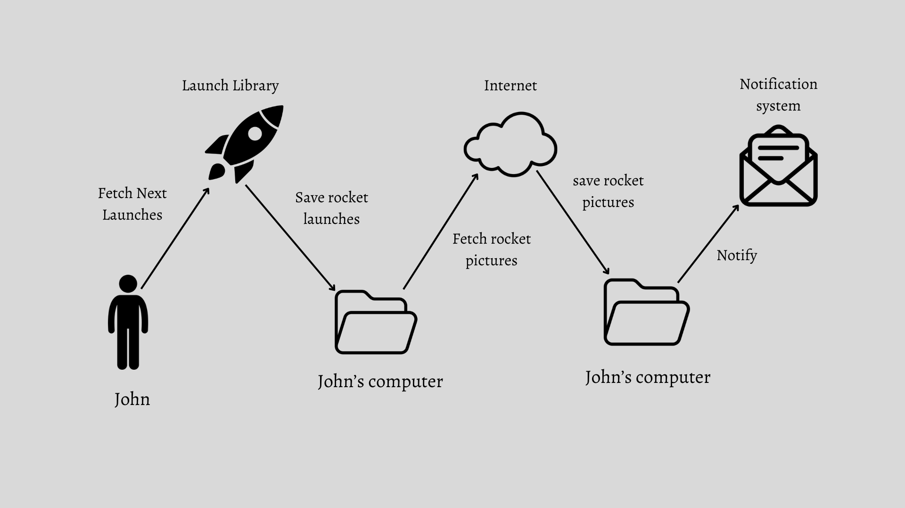
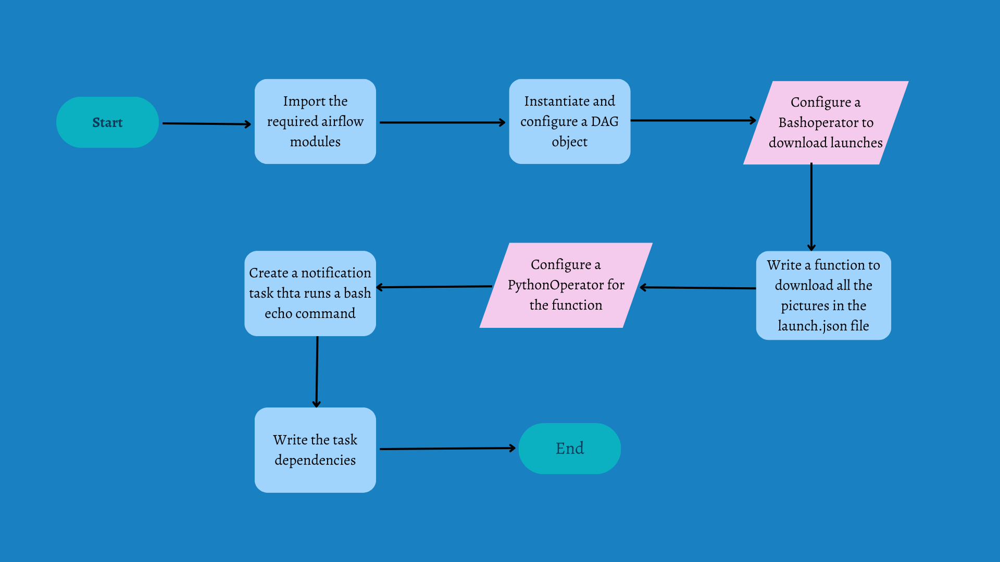

# Rocket Enthusiast Case Study

Let us dig into a use case of a rocket enthusiast to see how Airflow might help him.

We will cover the life of a rocket enthuisast named **John** who tracks and follows every single ***rocket launch.*** The news about rocket launches is found in many news sources that John keeps track of, and, ideally, John woud like to have all his rocket news aggregated in a single location. John recently picked up programming and would like to have some sort of automated way to colect information of all rocket launches and eventually some sort of personal insight into the latest rocket news. To start small, John decided to first collect images of rockets.

## Exploring the data
for the data, we make use of the [Launch library 2](https://thespacedevs.com/llapi), an online repository of data about both histoical and future rocket launches from various resources. It is free and open API for anybody on the planet (subject to rate limits). John is currently only interested in upcoming rocket launches. Luckily, the launch Library provides exactly the [data](https://ll.thespacedevs.com/2.0.0/launch/) he is looking for. It provides data about upcoming launches, together with URLs of where to find images of the respective rockets. Here's a snippet of the data this URL returns.

$ curl -L "https://ll.thespacedevs.com/2.0.0/launch/"

```java
{
    "count": 7361,
    "next": "https://ll.thespacedevs.com/2.0.0/launch/?limit=10&offset=10",
    "previous": null,
    "results": [
        {
            "id": "e3df2ecd-c239-472f-95e4-2b89b4f75800",
            "url": "https://ll.thespacedevs.com/2.0.0/launch/e3df2ecd-c239-472f-95e4-2b89b4f75800/",
            "launch_library_id": null,
            "slug": "sputnik-8k74ps-sputnik-1",
            "name": "Sputnik 8K74PS | Sputnik 1",
            "status": {
                "id": 3,
                "name": "Success"
            },
            "net": "1957-10-04T19:28:34Z",
            "window_end": "1957-10-04T19:28:34Z",
            "window_start": "1957-10-04T19:28:34Z",
            ...
            "image": "https://thespacedevs-prod.nyc3.digitaloceanspaces.com/media/images/sputnik_8k74ps_image_20210830185541.jpg",
            "infographic": null,
            "program": []
        },]
},

{
        {
            "id": "f8c9f344-a6df-4f30-873a-90fe3a7840b3",
            "url": "https://ll.thespacedevs.com/2.0.0/launch/f8c9f344-a6df-4f30-873a-90fe3a7840b3/",
            "launch_library_id": null,
            "slug": "sputnik-8k74ps-sputnik-1",
            "name": "Sputnik 8K74PS | Sputnik 1",
            "status": {
                "id": 3,
                "name": "Success"
            },
            "net": "1957-11-03T02:30:00Z",
            "window_end": "1957-11-03T02:30:00Z",
            "window_start": "1957-11-03T02:30:00Z",
            ...
            "image": "https://thespacedevs-prod.nyc3.digitaloceanspaces.com/media/images/sputnik_8k74ps_image_20210830185541.jpg",
            "infographic": null,
            "program": []
        },
},

...
```

## Mental Model
As you can see, the data is in JSON format and provides rocket launch information, and for every launch, there's information about the specific rocket, such as **ID**, **name**, and the **image URL**. This is exactly what John needs and he initially draws this plan to collect the images of upcoming rocket launches (e.g., to point his screensaver to the directory holding these images).

<p align="center" style="margin-bottom: 0px !important;">


## Flow chart
This flow chart shows the process that will be taken for the successful completion of the project. It serves as a guideline, which is an important step to take before we start representing and manifesting the entire process in codes.
<p align="center" style="margin-bottom: 0px !important;">



